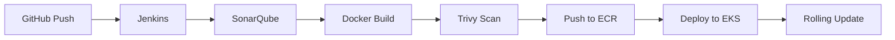

# DevOps Architecture — Walkthrough

Complete end-to-end DevOps setup for deploying a containerized Node.js app on AWS EKS.

## Files Created (18 total)

### Terraform (9 files)
| File | Purpose |
|---|---|
| [main.tf](file:///c:/Users/Chirag/Desktop/justTEst/demo/devops/terraform/main.tf) | AWS provider, version constraints, S3 backend |
| [variables.tf](file:///c:/Users/Chirag/Desktop/justTEst/demo/devops/terraform/variables.tf) | All input variables with defaults |
| [vpc.tf](file:///c:/Users/Chirag/Desktop/justTEst/demo/devops/terraform/vpc.tf) | VPC, 2 public + 2 private subnets, IGW, NAT, route tables |
| [security-groups.tf](file:///c:/Users/Chirag/Desktop/justTEst/demo/devops/terraform/security-groups.tf) | SGs for EKS cluster, nodes, Jenkins, ALB |
| [iam.tf](file:///c:/Users/Chirag/Desktop/justTEst/demo/devops/terraform/iam.tf) | IAM roles for EKS, nodes, Jenkins (least-privilege) |
| [eks.tf](file:///c:/Users/Chirag/Desktop/justTEst/demo/devops/terraform/eks.tf) | EKS cluster + managed node group (2–4 nodes, private subnets) |
| [ecr.tf](file:///c:/Users/Chirag/Desktop/justTEst/demo/devops/terraform/ecr.tf) | ECR repo with scan-on-push + lifecycle policy |
| [jenkins.tf](file:///c:/Users/Chirag/Desktop/justTEst/demo/devops/terraform/jenkins.tf) | Jenkins EC2 (Amazon Linux 2023, user_data bootstrap) |
| [outputs.tf](file:///c:/Users/Chirag/Desktop/justTEst/demo/devops/terraform/outputs.tf) | VPC, EKS, ECR, Jenkins outputs + helper commands |

### Docker (2 files)
| File | Purpose |
|---|---|
| [Dockerfile](file:///c:/Users/Chirag/Desktop/justTEst/demo/devops/docker/Dockerfile) | Multi-stage build, non-root user, health check |
| [.dockerignore](file:///c:/Users/Chirag/Desktop/justTEst/demo/devops/docker/.dockerignore) | Exclude node_modules, tests, .git |

### Kubernetes (3 files)
| File | Purpose |
|---|---|
| [namespace.yaml](file:///c:/Users/Chirag/Desktop/justTEst/demo/devops/kubernetes/namespace.yaml) | `nodejs-app` namespace |
| [deployment.yaml](file:///c:/Users/Chirag/Desktop/justTEst/demo/devops/kubernetes/deployment.yaml) | 3 replicas, rolling update, probes, topology spread |
| [service.yaml](file:///c:/Users/Chirag/Desktop/justTEst/demo/devops/kubernetes/service.yaml) | LoadBalancer (NLB) port 80 → 3000 |

### Jenkins (1 file)
| File | Purpose |
|---|---|
| [Jenkinsfile](file:///c:/Users/Chirag/Desktop/justTEst/demo/devops/jenkins/Jenkinsfile) | 7-stage pipeline: Checkout → SonarQube → Build → Trivy → ECR → EKS |

### Ansible (4 files)
| File | Purpose |
|---|---|
| [ansible.cfg](file:///c:/Users/Chirag/Desktop/justTEst/demo/devops/ansible/ansible.cfg) | SSH config, privilege escalation |
| [inventory.ini](file:///c:/Users/Chirag/Desktop/justTEst/demo/devops/ansible/inventory.ini) | Jenkins host definition |
| [jenkins-setup.yaml](file:///c:/Users/Chirag/Desktop/justTEst/demo/devops/ansible/playbooks/jenkins-setup.yaml) | Install Java, Jenkins, Docker, kubectl, AWS CLI, Trivy, SonarQube |
| [ssh-config.yaml](file:///c:/Users/Chirag/Desktop/justTEst/demo/devops/ansible/playbooks/ssh-config.yaml) | SSH hardening (disable root, password auth, X11) |

### Documentation (1 file)
| File | Purpose |
|---|---|
| [architecture.md](file:///c:/Users/Chirag/Desktop/justTEst/demo/devops/architecture.md) | AWS architecture diagram, component table, CI/CD flow, quick start |

## CI/CD Pipeline Flow

## Key Design Decisions

- **Worker nodes in private subnets** — no direct internet exposure, outbound via NAT
- **Rolling update** with `maxSurge: 1, maxUnavailable: 0` — zero-downtime deployments
- **Multi-stage Docker build** — smaller production image, no dev dependencies
- **Non-root container** — security best practice
- **Trivy exit-code 1 on HIGH/CRITICAL** — pipeline fails if vulnerabilities found
- **SonarQube quality gate** — blocks deployment on code quality issues
- **ECR lifecycle policy** — auto-cleanup, keeps only 10 images
- **Topology spread constraints** — pods distributed across nodes for HA
